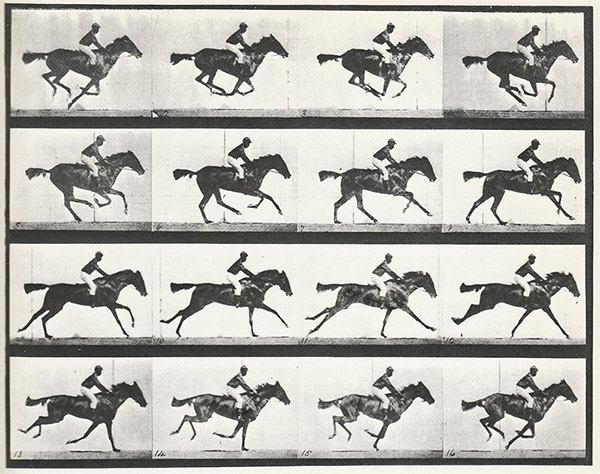
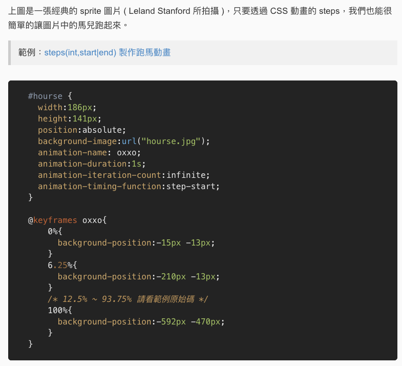

# Sprite 動畫範例
### 1. 什麼是Sprite圖片?
* [(以下說明引用自此網頁)](https://www.oxxostudio.tw/articles/201803/css-animation.html) 
* sprite 圖片就是將影格動畫的每一cut圖案集合成一張大圖，透過 CSS 的語法移動sprite圖片背景位置，完成動畫效果。


* 運用css3語法，做成動畫 


* [點此頁觀看上述動畫效果](https://www.oxxostudio.tw/demo/201803/css-animation-demo-05.html)

### 2. 與其他格式的差別？

* gif圖片作透明背景會有粗糙邊


* png圖片


  * apng圖片-可以直接動圖，但IE11不支援!!  
    ( [apng動圖範例](https://apng.onevcat.com/demo/) )

* sprite圖片 + css語法 = 動畫

  * Browser support: IE11, Edge, Firefox, Opera, Chrome, Safari

  * iOS 手機/平版也通用

### 3. Setting up
* html
```html
  <div class="sticker sticker-ani-2steps" style="background-image: url(ani2f.png);">
```
* css
```css
  .sticker{
    width: 200px;
    height: 200px;
    background-size: 200px 200px;
    /* 原本的圖片是(400x影格數) * 400px，我設定顯示區域為200x200px for手機 */
    background-repeat: no-repeat;
    background-position: 0px center;
    overflow: hidden;
  }
  .sticker-ani-2steps{
    animation-iteration-count: infinite; 
    animation-duration: 1s; 
    background-size: 400px 200px;
    animation-timing-function: steps(2,end); 
    animation-name: stickerAniSteps2;
  }
  
  @keyframes stickerAniSteps2
  {
      0% { background-position: 0px center;  }
      100% { background-position: -400px center;  } 
  }
```

### 4. Lotte 範例網頁 (http://demo.www.zhe.tw/lotte/+study/sprite/src/)


### 5. CSS animation-timing-function: steps 解說
* linear: 線性，沒有任何加速減速
* ease、ease-in、ease-out、ease-in-out: 具有加速減速的動畫
* steps(int,start|end): 

  step 系列算是比較少用的設定，顧名思義它就是「一步一步」，不會有中間的演算動畫，

  steps(5,start) = 走了「5步」到最後一個位置, 5步都顯示「移動後」的位置

  steps(5,end) = 走了「5步」到最後一個位置, 5步都顯示「移動前」的位置


* [steps css說明文件](https://www.zhangxinxu.com/wordpress/2018/06/css3-animation-steps-step-start-end/)

* [車車移動範例](https://designmodo.com/demo/stepscss/car.html)

* [monster多影格範例](https://codepen.io/Guilh/pen/yldGp)